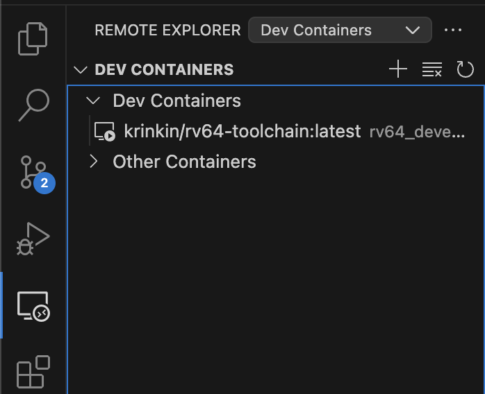
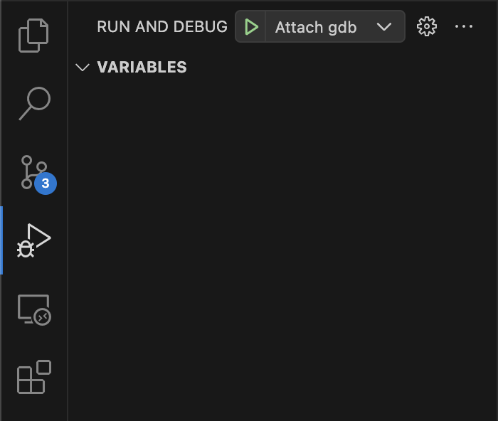
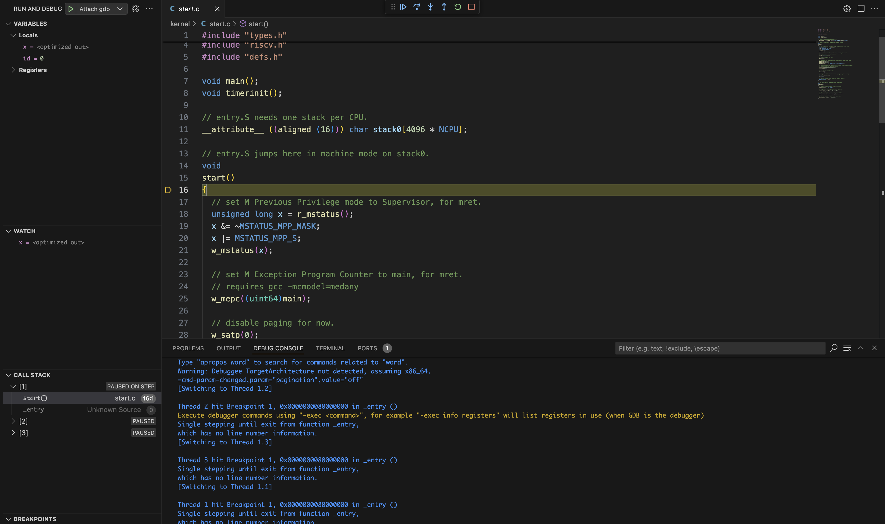

# How to have a nice development experience (Debugger + IDE features)

1. Install VS Code
2. Download [Dev Containers](https://marketplace.visualstudio.com/items?itemName=ms-vscode-remote.remote-containers) extension.
3. Run container using `attach.sh` script in [rv64-toolchain](https://github.com/krinkin/rv64-toolchain).
4. Attach to container in VS Code (see screenshot).

5. When you connected, open the folder with `os` sources.
6. Install [C/C++ Extension Pack](https://marketplace.visualstudio.com/items?itemName=ms-vscode.cpptools-extension-pack).
7. Run os with qemu in configuration `make qemu-gdb`.
8. Start debugger configuration `Attach gdb`

9. Have a nice debugger, highlighting, resolving and other IDE features.

## What happens under the hood
We installed a VS Code server inside a docker container with necessary plugin. Actually, IDE opened a folder within docker container and runs gdb there.

For any questions write **@Hardes1** in telegram.