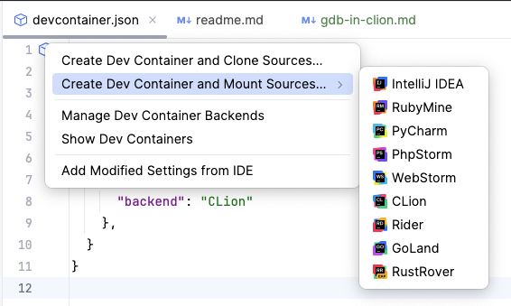
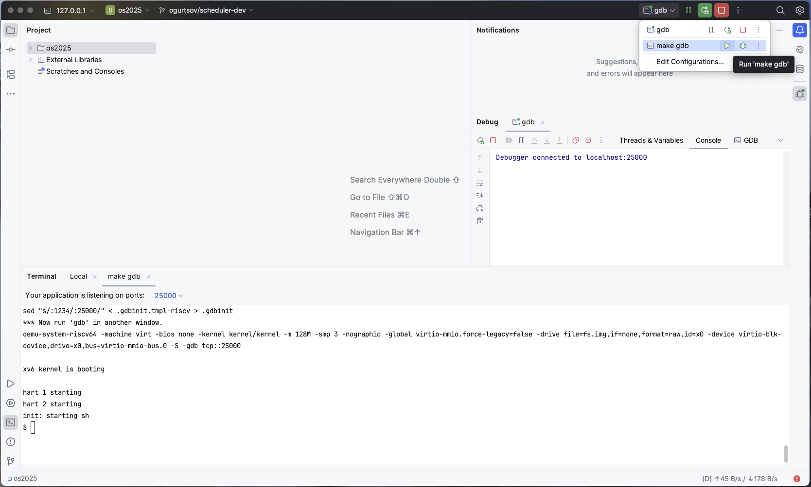

## [Watch Video on GitHub](https://github.com/krinkin/rv64-toolchain/pull/1)

### Or follow steps: 
1) Open [devcontainer.json](devcontainer.json) 
2) Click dev container icon

3) Choose Create dev container and mount sources, choose Clion
4) Choose qemu-gdb run configuration, run it
5) Debug gdb run configuration
